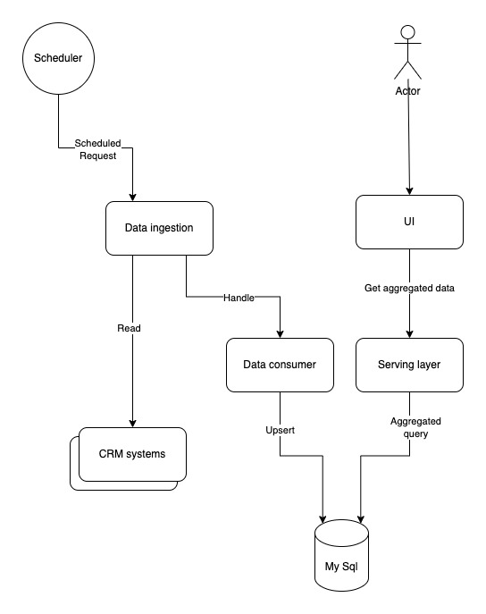

# Intuit Home assignment
## by Uri Haham
### Assumptions
1. crm API represent delta update. each call retrieve new set of values starting from the previous call.
2. No need for historical data, we only keep point in time status.
3. I choose not to implement On demand aggregation in the first phase.  

### Design
The system has the following components:
* Scheduler - an external scheduler such as jenkins that schedule data ingestion.
* Data Ingestion - incharge of reading updated data from Crm system and save them in storage.
* Crm simulator - simulate Crm api. 
* Serving layer - API server that serve the GUI application fetching data from storage.
* Storage - I choose mySql for sake of simplicity and in assumption we are not dealing with big data. other valid alternative is elastic search.

  

 

#### Data Ingestion
The logic we should implement in the data ingestion is as follows. We take the data from crm, sort it by datetime, break it to smaller chunks (if necessary). 
Then we should suppress duplicate by key and finally performing bulk upsert operations to MySql. 

#### Serving layer
In serving layer we do aggregation query based on the filter we got from API, in addition we perform additional query to get all keys with same filter. those two query can answer the aggregation API.  
In addition there is an API that returns support cases based on there keys.  

### Project status
The project is not connected to storage, all methods in data layer module need to be implemented. I choose not to do so based on the short time the home assignment should take.
Because of that the API do not return valid info.

One more issue is maven build that failed with test on, the maven integration to junit 5 still need to be improve. never the less the tests are running on my IDE.

